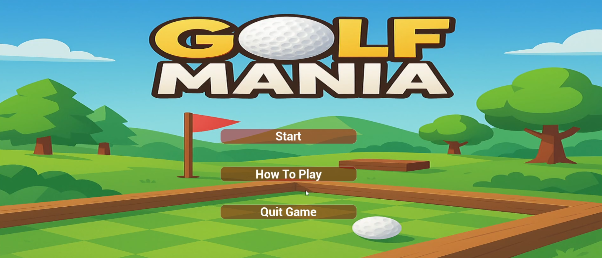
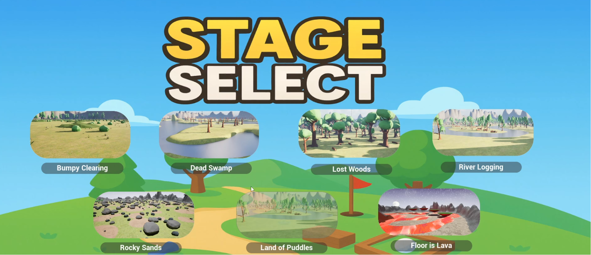
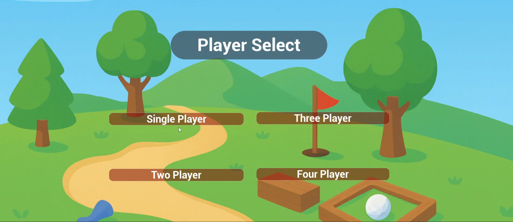
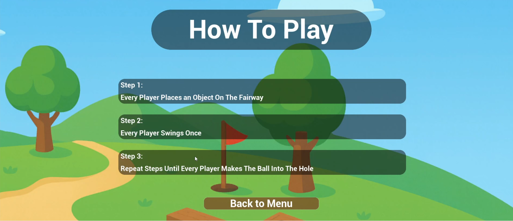
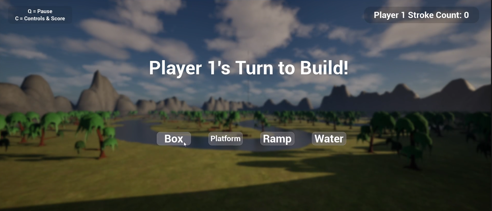
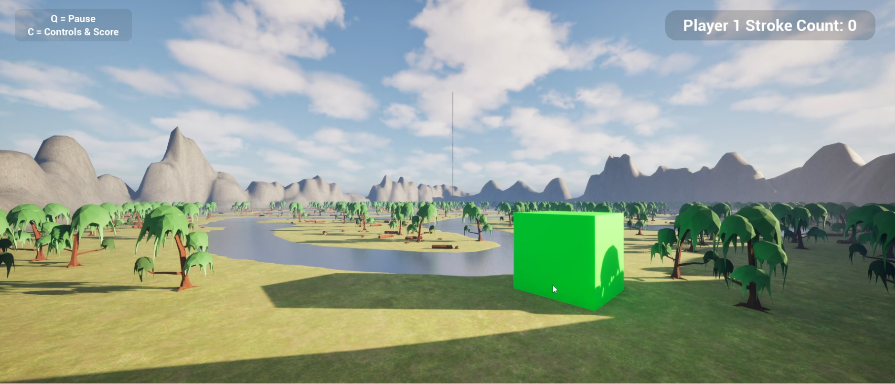
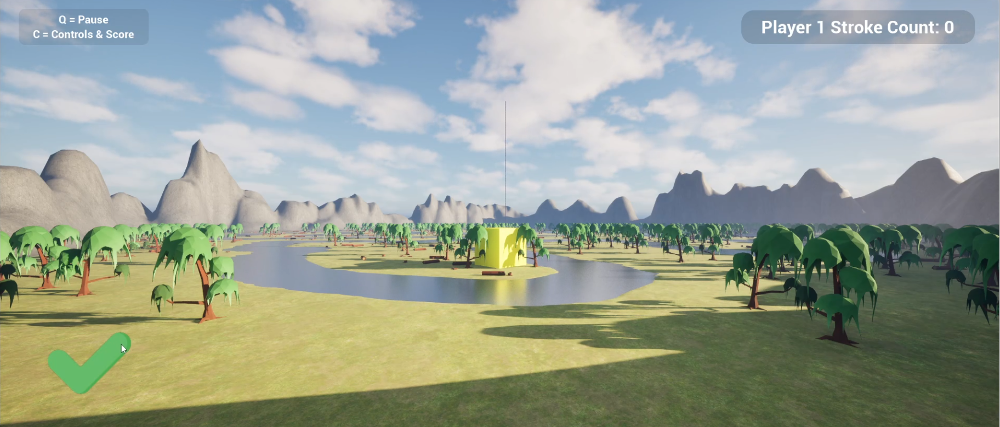
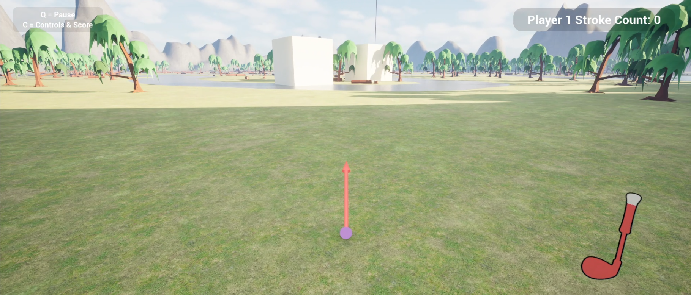
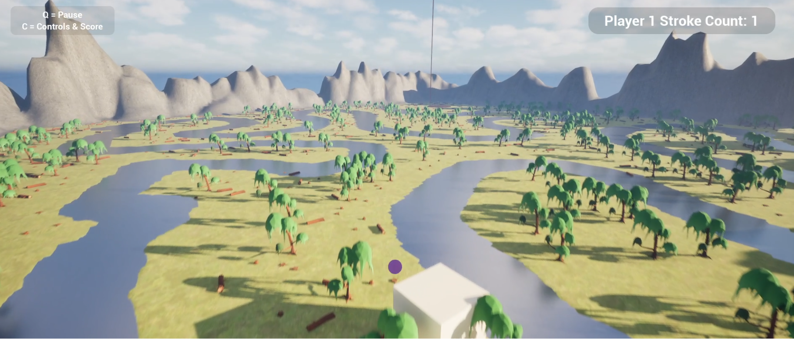
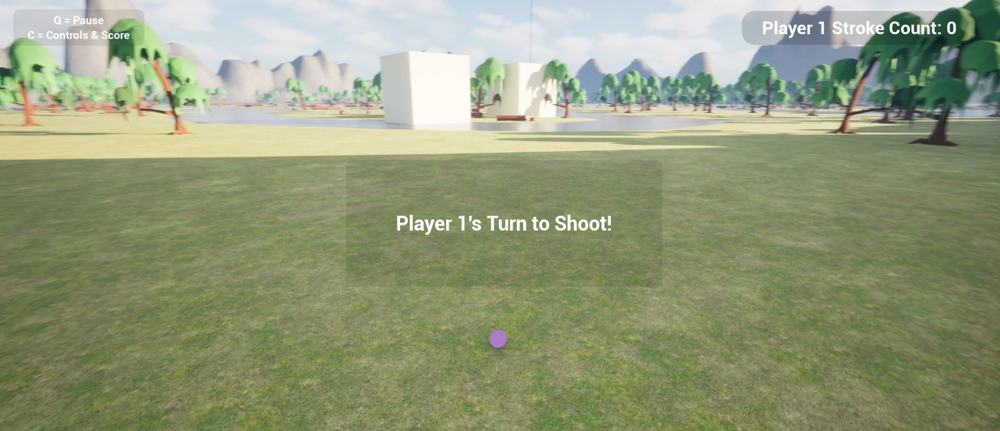

# Golf Mania Case Study
Local multiplayer golf game built in Unreal Engine 5 with Blueprints — obstacle placement, realistic ball physics, and turn-based gameplay for 1–4 players across 7 courses.

---

## What is Golf Mania

Golf Mania is a local multiplayer golf game supporting 1–4 players across 7 unique courses. Each round follows a build-then-swing loop — before swinging, every player places an obstacle on the fairway to interfere with opponents' shots. Players then take turns swinging until everyone sinks their ball, with the lowest stroke count winning. This project was built in a team of 4.

---

## Gameplay Preview

---

## Screenshots

---

## Tech Stack

| Component | Technology |
|---|---|
| Engine | Unreal Engine 5 |
| Logic | Blueprints (no C++) |
| Multiplayer | Local — split turn |
| Players | 1–4 |
| Maps | 7 unique courses |

---

## How To Play

1. Select number of players (1–4) and choose a course
2. Each player places an obstacle on the fairway (Box, Platform, Ramp, or Water)
3. Each player takes one swing
4. Repeat until every player sinks their ball
5. Lowest stroke count wins

---

## My Contributions

I built the core gameplay loop from scratch — everything required for a functional multiplayer golf game before the obstacle system and maps were added.

**Ball Physics**
Tuning realistic golf ball behavior was the most iterative part of the project. The main challenge was finding the right balance of linear and angular damping so the ball rolls naturally after landing and comes to a stop without sliding indefinitely or stopping too abruptly. Getting this to feel right took significant experimentation with UE5's physics settings.

**Swing System**
Built the full shot setup flow — direction control, height, and power selection visible to the player before each swing. The golf club UI and directional arrow give players clear visual feedback before committing to a shot.

**Hole Detection & Win Condition**
Implemented the logic that detects when a ball enters the hole, increments the stroke count, removes that player from the active rotation, and triggers the end-game sequence once all players have finished.

**Turn Sequencing**
Built the turn flow system that cycles through active players in order, displaying the correct player prompt on screen and handing control off cleanly between swings. The harder part was handling edge cases — players finishing at different times, making sure a finished player is skipped correctly without breaking the rotation for remaining players.

**Hazard System**
Built the hazard detection system that triggers penalties and special behavior when the ball enters course hazards such as water. This required detecting ball-hazard collisions reliably and handling the result correctly within the turn flow — repositioning the ball, applying a stroke penalty, and returning control to the active player without breaking the game state.

**Menus & Scoring**
Built the title screen, how to play screen, player select, and end-game scoring screen showing final stroke counts across all players.

---

## Team Contributions

| Contributor | Work |
|---|---|
| Chase (me) | Ball physics, swing system, hole logic, turn sequencing, hazard system, menus, scoring |
| Teammate | Obstacle placement and build phase system |
| Teammates | 7 course maps |
